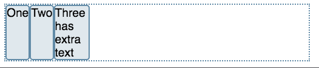
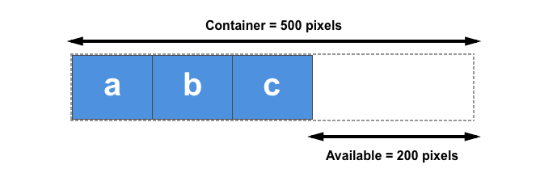
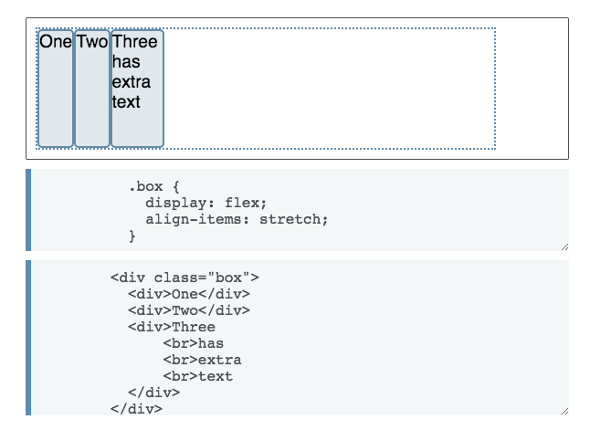
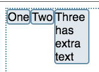
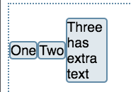

## CSS Flexbox 布局

### flexbox 的两根轴线


容器默认存在两根轴：水平的主轴（main axis）和垂直的交叉轴（cross axis）。主轴的开始位置（与边框的交叉点）叫做`main start`，结束位置叫做`main end`；交叉轴的开始位置叫做`cross start`，结束位置叫做`cross end`。

主轴由 `flex-direction` 定义(另一根轴垂直于它)，可以取4个值：

- `row`

- `row-reverse`

- `column`

- `column-reverse`

  ​

### Flex 容器

文档中采用了 flexbox 的区域就叫做 flex 容器。为了创建 flex 容器， 我们把一个容器的 [`display`](https://developer.mozilla.org/zh-CN/docs/Web/CSS/display) 属性值改为 `flex` 或者 `inline-flex。`(简单说来，如果你使用块元素如 div，你就可以使用 flex，而如果你使用行内元素，你可以使用 inline-flex。) 完成这一步之后，容器中的直系子元素就会变为 **flex 元素**。所有CSS属性都会有一个初始值，所以 flex 容器中的所有 flex 元素都会有下列行为：

- 元素排列为一行 (`flex-direction` 属性的初始值是 `row`)。
- 元素从主轴的起始线开始。
- 元素不会在主维度方向拉伸，但是可以缩小。
- 元素被拉伸来填充交叉轴大小。
- [`flex-basis`](https://developer.mozilla.org/zh-CN/docs/Web/CSS/flex-basis) 属性为 `auto。`
- [`flex-wrap`](https://developer.mozilla.org/zh-CN/docs/Web/CSS/flex-wrap) 属性为 `nowrap。`

这会让你的元素呈线形排列，并且把自己的大小作为主轴上的大小。如果有太多元素超出容器，它们会溢出而不会换行。如果一些元素比其他元素高，那么元素会沿交叉轴被拉伸来填满它的大小：



```css
.box {
	display: flex;
}    
```

```html
<div class="box">
  <div>One</div>
  <div>Two</div>
  <div>Three
      <br>has
      <br>extra
      <br>text
  </div>
</div>
```


### 用flex-wrap实现多行效果

为了实现多行效果，请为属性[`flex-wrap`](https://developer.mozilla.org/zh-CN/docs/Web/CSS/flex-wrap)添加一个属性值`wrap`。 现在，如果您的项目太大而无法全部显示在一行中，则会换行显示。 下面的实时例子包含已给出宽度的项目，对于`flex`容器，项目的子元素总宽度大于容器最大宽度。 由于`flex-wrap`的值设置为`wrap`，所以项目的子元素换行显示。若将其设置为`nowrap`，这也是初始值，它们将会缩小以适应容器，因为它们使用的是允许缩小的初始`Flexbox`值。 如果项目的子元素无法缩小，使用`nowrap`会导致溢出，或者缩小程度还不够小。


### flex 元素上的属性

假设在 1 个 500px 的容器中，我们有 3 个 100px 宽的元素，那么这 3 个元素需要占 300px 的宽，剩下 200px 的布局空白。在默认情况下， flexbox 的行为会把这 200px 的空白留在最后一个元素的后面。



为了更好地控制 flex 元素，有三个属性可以作用于它们：

- [`flex-grow`](https://developer.mozilla.org/zh-CN/docs/Web/CSS/flex-grow)

- [`flex-shrink`](https://developer.mozilla.org/zh-CN/docs/Web/CSS/flex-shrink)

- [`flex-basis`](https://developer.mozilla.org/zh-CN/docs/Web/CSS/flex-basis)

- order

  ​

  ​

#### Flex 元素属性：`flex-basis`

`flex-basis` 定义了该元素的**布局空白（**available space）的基准值。 该属性的默认值是 `auto` 。此时，浏览器会检测这个元素是否具有确定的尺寸。 在上面的例子中, 所有元素都设定了宽度（width）为100px，所以 `flex-basis` 的值为100px。


#### Flex 元素属性：`flex-grow`

`flex-grow` 若被赋值为一个正整数， flex 元素会以 `flex-basis` 为基础，沿主轴方向增长尺寸。这会使该元素延展，并占据此方向轴上的布局空白（available space）。如果有其他元素也被允许延展，那么他们会各自占据布局空白的一部分。

如果我们给上例中的所有元素设定 `flex-grow` 值为1， 容器中的布局空白会被这些元素平分。它们会延展以填满容器主轴方向上的空间。

flex-grow 属性可以按比例分配空间。如果第一个元素 `flex-grow` 值为2， 其他元素值为1，则第一个元素将占有2/4（上例中，即为 200px 中的 100px）, 另外两个元素各占有1/4（各50px）。


#### Flex 元素属性： `flex-shrink`

`flex-grow`属性是处理flex元素在主轴上增加空间的问题，相反`flex-shrink`属性是处理flex元素收缩的问题。如果我们的容器中没有足够排列flex元素的空间，那么可以把flex元素`flex-shrink`属性设置为正整数来缩小它所占空间到`flex-basis`以下。与`flex-grow属性一`样，可以赋予不同的值来控制flex元素收缩的程度 —— 给`flex-shrink`属性赋予更大的数值可以比赋予小数值的同级元素收缩程度更大。

在计算flex元素收缩的大小时，它的最小尺寸也会被考虑进去，就是说实际上flex-shrink属性可能会和flex-grow属性表现的不一致。因此，我们可以在文章《[控制Flex子元素在主轴上的比例](https://developer.mozilla.org/zh-CN/docs/Web/CSS/CSS_Flexible_Box_Layout/Controlling_Ratios_of_Flex_Items_Along_the_Main_Ax)》中更详细地看一下这个算法的原理。


#### Flex 元素属性： `order`

**order: 定义项目在容器中的排列顺序，数值越小，排列越靠前，默认值为 0**

```
.item {
    order: <integer>;
}
```


#### Flex 元素属性： `align-self`

`align-self`属性允许单个项目有与其他项目不一样的对齐方式，可覆盖`align-items`属性。默认值为`auto`，表示继承父元素的`align-items`属性，如果没有父元素，则等同于`stretch`。


#### Flex属性的简写

你可以在下面的实例中尝试把flex简写形式中的数值更改为不同数值，但要记得第一个数值是 `flex-grow`。赋值为正数的话是让元素增加所占空间。第二个数值是`flex-shrink` — 正数可以让它缩小所占空间，但是只有在flex元素总和超出主轴才会生效。最后一个数值是 `flex-basis`；flex元素是在这个基准值的基础上缩放的。如:

```css
.one {
    flex: 1 1 auto;
}
```

大多数情况下可以用预定义的简写形式。 在这个教程中你可能经常会看到这种写法，许多情况下你都可以这么使用。下面是几种预定义的值：

- `flex: initial`
- `flex: auto`
- `flex: none`
- `flex: <positive-number>`

`flex: initial` 是把flex元素重置为Flexbox的初始值，它相当于 `flex: 0 1 auto`。在这里 `flex-grow` 的值为0，所以flex元素不会超过它们 `flex-basis` 的尺寸。`flex-shrink` 的值为1, 所以可以缩小flex元素来防止它们溢出。`flex-basis` 的值为 `auto`. Flex元素尺寸可以是在主维度上设置的，也可以是根据内容自动得到的。

`flex: auto` 等同于 `flex: 1 1 auto`；和上面的 `flex:initial` 基本相同，但是这种情况下，flex元素在需要的时候既可以拉伸也可以收缩。

`flex: none` 可以把flex元素设置为不可伸缩。它和设置为 `flex: 0 0 auto` 是一样的。元素既不能拉伸或者收缩，但是元素会按具有 `flex-basis: auto` 属性的flexbox进行布局。

你在教程中常看到的 `flex: 1` 或者 `flex: 2` 等等。它相当于`flex: 1 1 0`。元素可以在`flex-basis`为0的基础上伸缩。


#### 元素间的对齐和空间分配

##### `align-items`

align-items属性可以使元素在交叉轴方向对齐。

这个属性的初始值为`stretch`，这就是为什么flex元素会默认被拉伸到最高元素的高度。实际上，它们被拉伸来填满flex容器 —— 最高的元素定义了容器的高度。

你也可以设置`align-items`的值为`flex-start`，使flex元素按flex容器的顶部对齐, `flex-end` 使它们按flex容器的下部对齐, 或者`center`使它们居中对齐. 在实例中尝试——我给出了flex容器的高度，以便你可以看到元素在容器中移动。看看如果更改 align-items的值为下列值会发生什么：



flex-start:



center:



##### `justify-content`

[`justify-content`](https://developer.mozilla.org/zh-CN/docs/Web/CSS/justify-content)属性用来使元素在主轴方向上对齐，主轴方向是通过 `flex-direction` 设置的方向。初始值是`flex-start`，元素从容器的起始线排列。但是你也可以把值设置为`flex-end`，从终止线开始排列，或者`center`，在中间排列.

你也可以把值设置为`space-between`，把元素排列好之后的剩余空间拿出来，平均分配到元素之间，所以元素之间间隔相等。或者使用`space-around`，使每个元素的左右空间相等。

在实例中尝试下列`justify-content`属性的值：

- `stretch`
- `flex-start`
- `flex-end`
- `center`
- `space-around`
- `space-between`


##### `align-content`

 定义了多根轴线的对齐方式，如果项目只有一根轴线，那么该属性将不起作用

```css
.container {
    align-content: flex-start | flex-end | center | space-between | space-around | stretch;
}
```

这个这样理解：

**当你 flex-wrap 设置为 nowrap 的时候，容器仅存在一根轴线，因为项目不会换行，就不会产生多条轴线。**

**当你 flex-wrap 设置为 wrap 的时候，容器可能会出现多条轴线，这时候你就需要去设置多条轴线之间的对齐方式了。**

